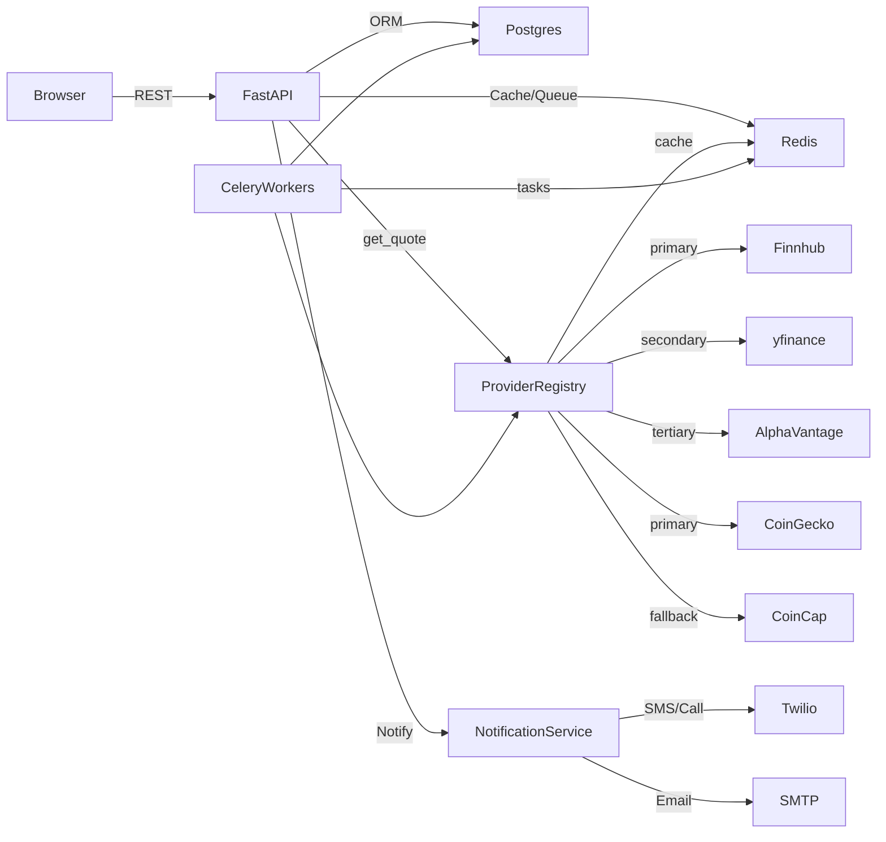

# MarketEye Architecture

## Purpose & Scope
- Purpose: Provide real-time market monitoring, alerting, and portfolio tracking with a demo-friendly experience.
- Scope: Frontend (React) + Backend (FastAPI) + PostgreSQL + Redis + Celery workers + external market/notification providers.

## Components
- **Frontend (Vite + React/TS)**: Routes (`Landing`, `Login`, `Register`, `Dashboard`), consumes public and authenticated APIs.
- **API Gateway (FastAPI)**: Routes under `/api/v1`, includes public endpoints for landing data and authenticated endpoints for alerts, portfolio, watchlists, notifications.
- **Database (PostgreSQL)**: Persists users, assets, alerts, portfolios, watchlists; migrations via Alembic.
- **Cache/Broker (Redis)**: Shared market-data cache (stale-while-revalidate) and Celery broker.
- **Workers (Celery)**: Market data refresh, alert evaluation, portfolio recompute, cleanup.
- **External Providers**: Multi-provider market data (Finnhub, yfinance, Alpha Vantage, CoinGecko, CoinCap); Twilio/SMTP for notifications (simulated when credentials missing).

## High-Level Flow

## Provider Fallback Chain

### Stocks / ETFs
1. **Finnhub** (primary) -- 60 calls/min free tier, real-time US quotes. Requires `FINNHUB_API_KEY`.
2. **yfinance** (secondary) -- serialized with 1s gap between calls to avoid 429s.
3. **Alpha Vantage** (tertiary) -- 25-500 calls/day. Requires `ALPHA_VANTAGE_API_KEY`.

### Crypto
1. **CoinGecko** (primary) -- ~30 calls/min, rich data.
2. **CoinCap** (fallback) -- no API key, 200 req/min.

### Mutual Funds
- **yfinance** only (no other free provider covers NAV data). Serialized.

## Resilience Patterns

- **Circuit Breaker**: Per-provider failure tracking (configurable threshold/timeout). After N consecutive failures, the provider is skipped for a cooldown period. Half-open state allows one probe request to recover.
- **Exponential Backoff with Jitter**: On HTTP 429/5xx, retries up to 2 times with `(2^attempt * 0.5) + random(0, 0.5)` second delays. All retries run inside `asyncio.to_thread`; the event loop is never blocked.
- **Stale-While-Revalidate Cache**: Two TTLs -- `CACHE_FRESH_TTL_SECONDS` (5 min default) and `CACHE_STALE_TTL_SECONDS` (30 min default). If all providers fail, stale data is returned rather than nothing.
- **Redis-Backed Shared Cache**: Cache is stored in Redis under `marketeye:price:{type}:{SYMBOL}` keys, shared across the backend and all Celery workers. Falls back to an in-memory dict if Redis is unavailable.

## Functional Flow (Typical Alert Creation & Trigger)
1. User authenticates and creates an alert via `/api/v1/alerts`.
2. Alert stored in PostgreSQL; any cache warmed in Redis if enabled.
3. Celery alert worker runs on schedule, fetches latest prices via `ProviderRegistry`.
4. Worker evaluates alert conditions, writes status back to PostgreSQL.
5. When triggered, `NotificationService` sends SMS/call/email (or demo-mode logs).
6. Frontend polls or refreshes data to reflect alert status.

## Failure Paths & Mitigations
- **Market data provider slow/unavailable**: Circuit breaker skips failing providers; fallback chain tries alternatives; stale cache serves last-known-good data.
- **All providers down**: Stale-while-revalidate returns cached data up to 30 minutes old.
- **Notification provider missing/invalid credentials**: NotificationService simulates sends in demo mode and logs instead of raising.
- **Database connectivity issues**: SQLAlchemy engine uses `pool_pre_ping`; workers retry via Celery policies.
- **Redis unavailable**: Cache falls back to in-memory dict; tasks queue will fail but app still serves stateless public endpoints.

## Security Considerations
- JWT-based auth for private routes; public routes restricted to read-only market data.
- Secrets provided via environment variables; never committed.
- CORS restricted to configured origins.
- Input validation via Pydantic schemas on API routes.
- Logging avoids sensitive values; prefer structured logs with request IDs.

## Performance Considerations
- Redis-backed cache (5 min fresh, 30 min stale) shared across all processes.
- All blocking provider calls run in threads via `asyncio.to_thread`.
- yfinance serialized to semaphore(1) with 1s token-bucket gap to avoid Yahoo 429s.
- Finnhub primary for stocks allows 60 concurrent calls/min without rate issues.
- Public trending endpoint fetches all 38 assets concurrently via `asyncio.gather`.
- Celery worker batch price updates also use `asyncio.gather`.
- Public endpoints avoid DB lookups and rely on cached provider responses.

## Observability
- Health endpoint: `/health`.
- API docs: `/docs`.
- Celery Flower recommended for task monitoring (if enabled).
- Log key events: provider failures, circuit breaker state changes, notification outcomes, worker task errors.

## Configuration (env)
- `DATABASE_URL`, `DATABASE_URL_SYNC` (required)
- `REDIS_URL`, `SECRET_KEY`, `CORS_ORIGINS`
- Market data: `FINNHUB_API_KEY`, `ALPHA_VANTAGE_API_KEY`, `COINGECKO_API_KEY` (all optional; app degrades gracefully)
- `COINCAP_ENABLED` (default true), `PROVIDER_CIRCUIT_BREAKER_THRESHOLD`, `PROVIDER_CIRCUIT_BREAKER_TIMEOUT`
- `CACHE_FRESH_TTL_SECONDS`, `CACHE_STALE_TTL_SECONDS`
- Notification: `TWILIO_*`, `SMTP_*`
- Alert/worker tuning: `ALERT_CHECK_INTERVAL_SECONDS`, `MARKET_DATA_CACHE_TTL_SECONDS`

## Deployment
- Recommended: `docker-compose up -d` then `docker-compose exec backend alembic upgrade head`.
- Backend exposed on `:8000`; frontend on `:5173`; ensure Redis/Postgres reachable.
- Set `FINNHUB_API_KEY` for reliable stock data; without it, yfinance is the only stock provider.

## Troubleshooting First Checks
- Backend not starting: confirm required env vars and DB reachable.
- Market data empty: check circuit breaker logs; verify `FINNHUB_API_KEY` is set; review provider rate limits.
- Only crypto showing: yfinance rate-limited and no Finnhub key set; add `FINNHUB_API_KEY`.
- Notifications missing: check credentials; demo mode logs expected without secrets.
- Celery tasks stuck: check Redis connectivity and worker logs; verify broker URL.
