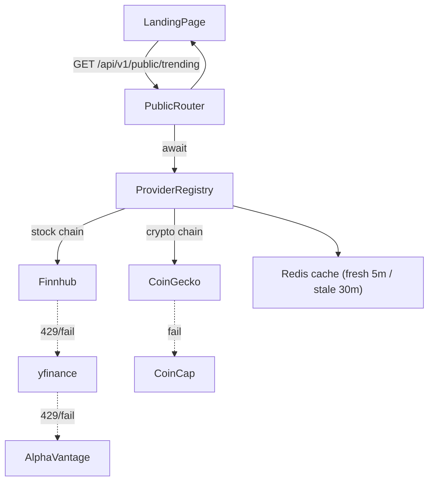

# Public Market Data & Landing Experience

## Purpose
Provide unauthenticated, zero-credential market data to power the landing page and demos without breaking production security.

## Scope
- Endpoints: `/api/v1/public/trending`, `/api/v1/public/market-stats`, `/api/v1/public/history`, `/api/v1/public/asset/{symbol}/price`, `/api/v1/public/asset/{symbol}/history`, `/api/v1/public/search`.
- Consumers: `frontend/src/pages/Landing.tsx`, future marketing pages, monitoring checks.

## Inputs & Outputs
- Inputs: optional query params (`symbol`, `asset_type`, `period`, `interval`, `q`).
- Outputs: JSON with asset arrays, market summary, historical data arrays, platform stats, or search results.
- No authentication headers required; responses avoid PII and user-specific data.

## Dependencies
- `ProviderRegistry` with multi-provider fallback chain (Finnhub, yfinance, Alpha Vantage for stocks; CoinGecko, CoinCap for crypto).
- Redis-backed shared cache with stale-while-revalidate semantics.
- FastAPI app wiring in `app.main`.
- Configuration: `CACHE_FRESH_TTL_SECONDS`, `CACHE_STALE_TTL_SECONDS`, `FINNHUB_API_KEY`, provider timeouts.

## Functional Flow (Trending)

1. Landing page calls trending and stats in parallel.
2. `get_trending_assets` fetches stocks, crypto, and funds concurrently via `asyncio.gather`.
3. Each fetch goes through the `ProviderRegistry` fallback chain with per-provider circuit breakers.
4. Successful results are cached in Redis; stale data served when all providers fail.
5. Frontend renders live cards and updates every 60 seconds.

## Provider Chain Details

### Stocks / ETFs
| Priority | Provider | Rate Limit | API Key |
|---|---|---|---|
| 1 | Finnhub | 60/min | `FINNHUB_API_KEY` |
| 2 | yfinance | serialized (1/sec) | none |
| 3 | Alpha Vantage | 25-500/day | `ALPHA_VANTAGE_API_KEY` |

### Crypto
| Priority | Provider | Rate Limit | API Key |
|---|---|---|---|
| 1 | CoinGecko | ~30/min | none |
| 2 | CoinCap | 200/min | none |

### Mutual Funds
- yfinance only (serialized). No other free provider covers NAV data.

## Resilience Patterns
- **Circuit Breaker**: Per-provider; opens after 5 consecutive failures, resets after 60s cooldown.
- **Retry with Backoff**: HTTP 429/5xx retried up to 2 times with exponential delay + jitter.
- **Stale-While-Revalidate**: Fresh TTL 5 min, stale TTL 30 min. Stale data returned when providers fail.
- **Shared Redis Cache**: Cache survives container restarts and is shared across backend + Celery workers.

## Failure Paths
- Provider timeout/HTTP error: circuit breaker records failure; next provider in chain is tried.
- All providers fail: stale cache returned (up to 30 min old); endpoint never 500s.
- Provider returns missing fields: asset ignored to avoid bad data on landing.
- Redis unavailable: in-memory fallback cache used automatically.
- Unexpected exception: caught and logged; endpoint keeps returning partial data.

## Security Considerations
- Endpoints are read-only and do not expose user data.
- CORS restricted via settings.
- No secrets embedded in responses; provider keys come from env when required.
- Rejects empty search queries to avoid unnecessary provider calls.

## Performance Considerations
- Redis-backed cache shared across all processes; 5 min fresh TTL, 30 min stale TTL.
- All provider calls offloaded to threads (`asyncio.to_thread`) so they never block the event loop.
- Finnhub primary for stocks allows 60 calls/min without rate issues; eliminates yfinance 429 bottleneck.
- yfinance serialized to `asyncio.Semaphore(1)` with 1s token-bucket gap; only used as fallback.
- `get_trending_assets` uses `asyncio.gather` to fetch all 38 assets concurrently.
- CoinGecko/CoinCap requests use 10s timeouts.
- Public endpoints avoid database access, keeping latency low for marketing traffic.

## Test Cases
- CircuitBreaker opens after threshold failures, transitions to half-open after timeout, closes on success.
- ProviderRegistry uses first healthy provider, falls back on failure, skips open circuits.
- ProviderRegistry returns stale cache when all providers fail.
- Cache correctly distinguishes fresh vs. stale vs. expired entries.
- Trending aggregation counts gainers/losers correctly with mixed positive/negative deltas.
- Stock price fetch caches responses and computes percent change from previous close.
- Crypto price fetch maps symbols to CoinGecko IDs, returns core fields, and caches results.
- Trending endpoint returns partial data when some providers fail (graceful degradation).

## Operational Notes
- Set `FINNHUB_API_KEY` for reliable stock data; without it, only yfinance (rate-limited) is available.
- Monitor circuit breaker state changes in logs (`CircuitBreaker OPEN for {provider}`).
- If all providers are blocked in an environment, stale cache serves data for up to 30 minutes.
- Adjust `CACHE_FRESH_TTL_SECONDS` and `CACHE_STALE_TTL_SECONDS` to tune freshness vs. resilience.
